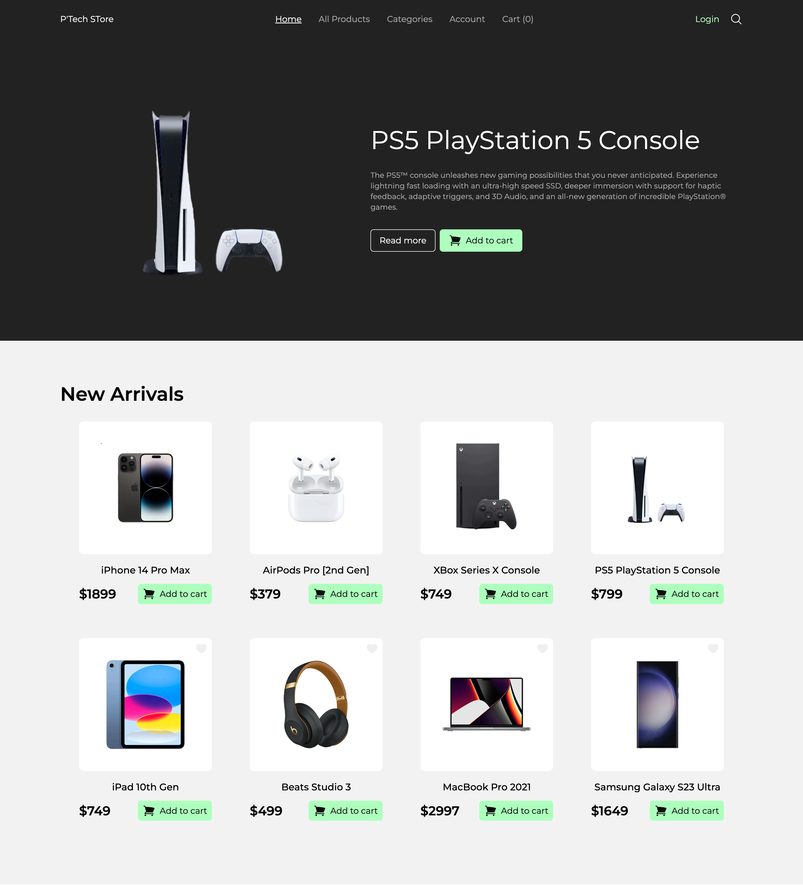
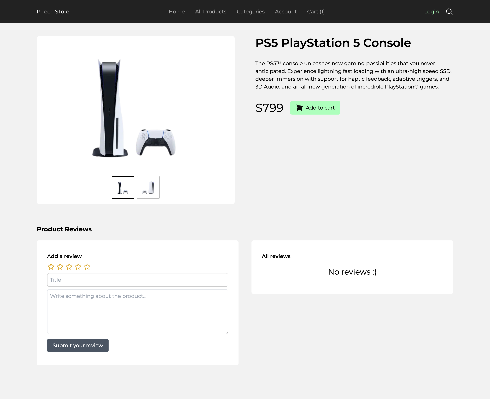
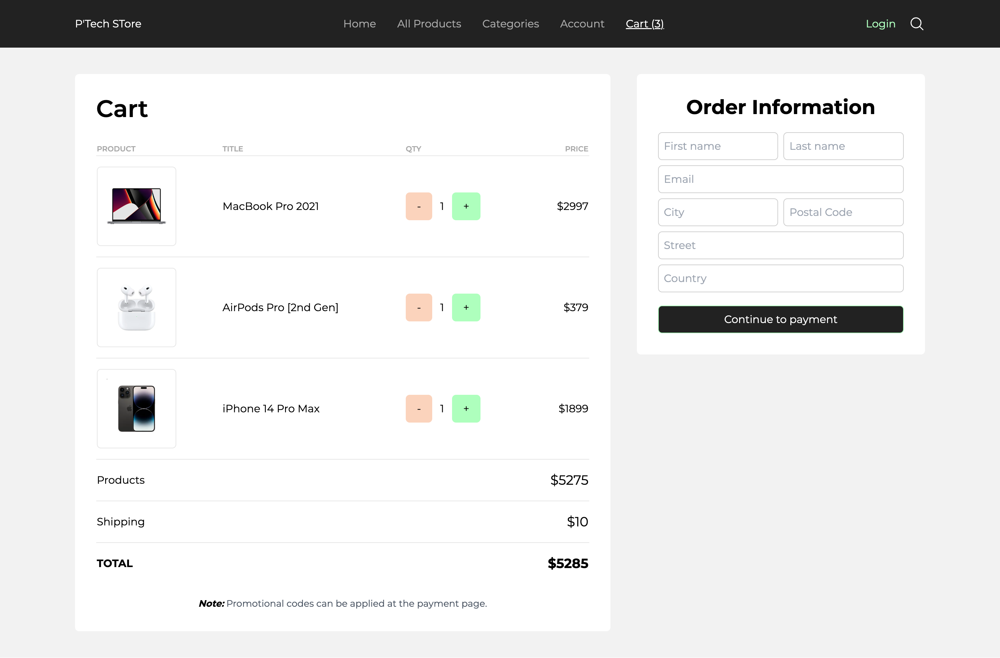
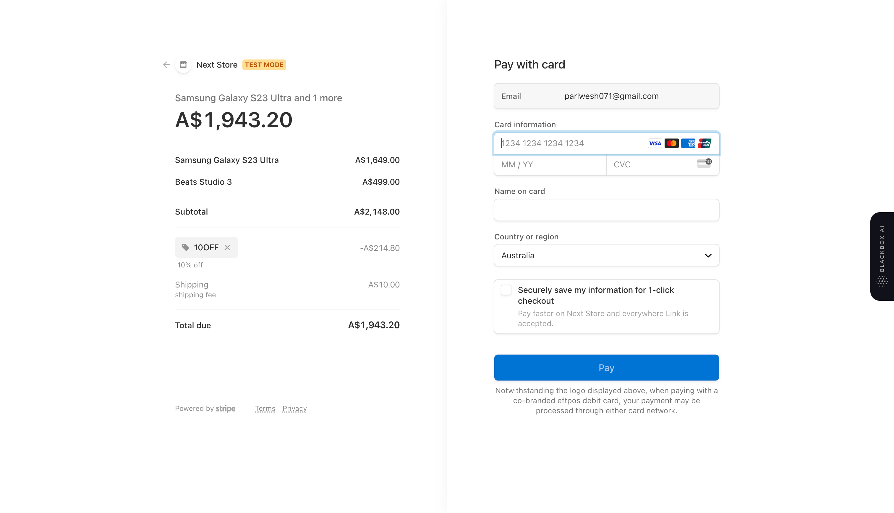
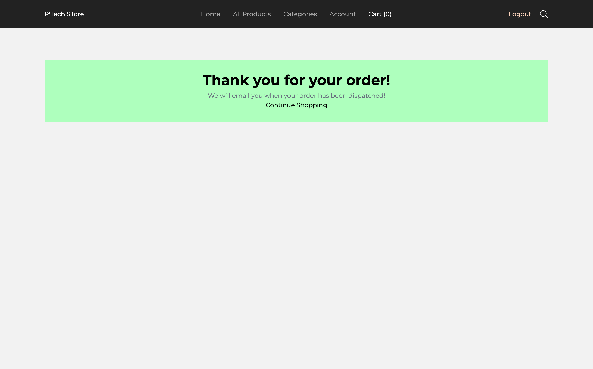

# E-commerce || Built with NextJs and Payment gateway - Stripe.

<div align="center">
  
  &nbsp;&nbsp;

</div>

# Deploy in **VERCEL**  <a href="[https://ecommerce-full-stack-next-app.vercel.app/](https://next-ecomm-store-front.vercel.app/)" target="_blank" target="_blank" title="E-commerce shop" >Click Here!</a> 

# Quick Overview - Setup & Run

#### Step - 1

Download or Clone

```sh
git clone https://github.com/pariweshtamr/next-ecomm-store-front.git
```

#### Step - 2

```bash
cd next-ecomm-store-front
```

#### Step - 4

```bash
npm i
#or
npm install
#or
yarn add
```

#### Step - 5

create `.env` file from `.env.example` need [Stripe](https://stripe.com/), [Next-Auth]([https://www.sanity.io/](https://next-auth.js.org/)), [Google](https://console.cloud.google.com/)

- MONGODB_URI
- STRIPE_PK
- STRIPE_SK
- NEXTAUTH_URL
- NEXT_PUBLIC_URL
- CLIENT_URL
- NEXTAUTH_SECRET
- GOOGLE_FRONT_ID
- GOOGLE_FRONT_SECRET
- WEBHOOK_SECRET 


#### Step - 6

Build & Run the project

First, run the development server:

```bash
npm run dev
#or
yarn dev
```

Open [http://localhost:3000](http://localhost:3000) with your browser to see the result.

# Screenshot

## #Homepage



## #Product Page



## #Cart



## #Payment Page - Stripe



## #Purchased


